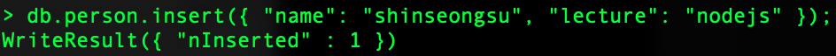

# MongoDB

- mongoDB 란 무엇인가

key Value 형태로 저장

```
{
    "name": "여성워커",
    "price": 1200
}
```

- 동적 스키마

1번째 {"name": "여성워커", "Price":1200}
2번째 {"thumbnamil": "abc.png"}


- mongoDB cli 사용해보기

```
use exercise;
```

위 명령어를 사용학게 되면 exercise database 를 사용 한다는 명령어 이다.

```
db.person.insert({ "name": "shinseongsu", "lecture": "nodejs" });
```

위 처럼 json 형식의 insert를 cli의 넣게 되면 name, lecture 데이터가 생긴다.




<br>
<br>

다중으로 데이터를 넣을려면 이렇게 넣으면 된다.


한번의 데이터 말고 여러개의 데이터를 넣고 싶을 때는 [] 안에 {} 형태를 , 로 여러개 넣는다.

```
db.board.insert([
    {
        "title" : "Hello",
        "content" : "첫번째글입니다.",
        "writer" : "admin",
        "hit" : 2
    },
    {
        "title" : "Hi",
        "content" : "두번째 글입니다.",
        "writer" : "admin",
        "hit" : 23
    },
    {
        "title" : "test",
        "content" : "세번째 글입니다.",
        "writer" : "test",
        "hit" : 10
    }
])
```


- DB 값을 조회하는 방법

```
db.person.find()
```


> find() 뒤에 count(), sort(), limit(), skip() 등 여러 함수를 사용 할 수 있다.


- DB 값 변경하기

DB 값을 변경하기 위해서는 db.person.update 와 같은 형식으로 사용을 한다.

update 안에 조건문과 변경될 같은 넣으면 된다.
예를 들어, lecture 값이 node.js인 값을 바꾸고 싶으면 밑에와 같이 사용하면 된다.

```
db.person.update( 
    { "name" : "shinseongsu" }, 
    { $set: { "lecture" : "mongoDB" } } 
)
```
$set은 변경 되지 않는 부분은 사라지지 않기 위해서 썼다.


결과적으로 node.js 를 mongoDB로 변경이 되었다.

- DB 값 제거

remove 를 이용하여 안에 조건값을 넣어 값을 삭제할 수 있다.

```
db.person.remove( { "name" : "shinseongsu" } )
```

