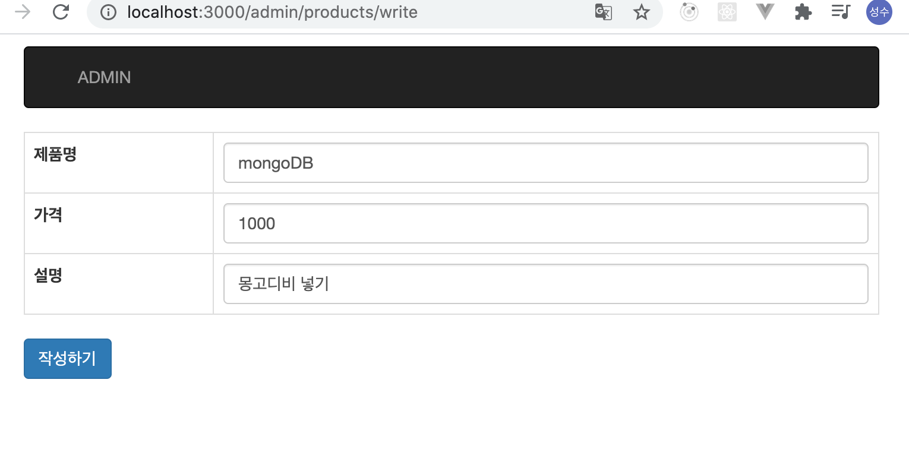
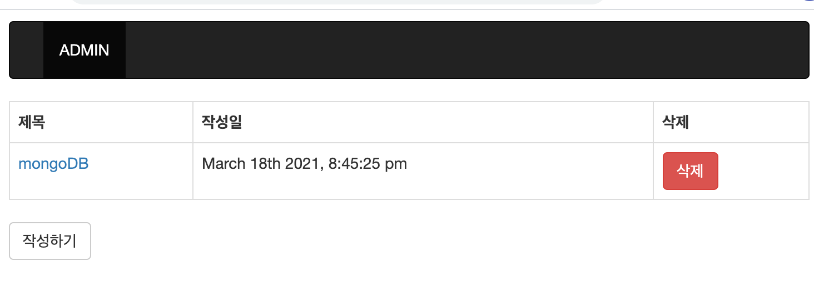
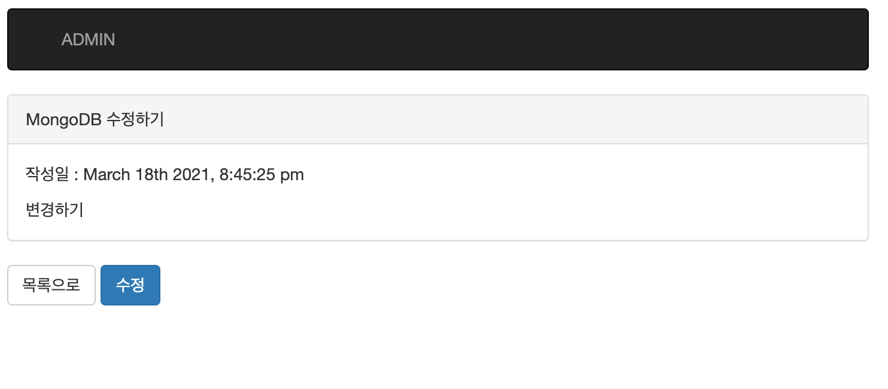
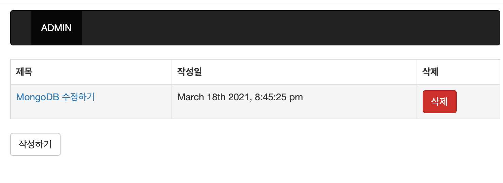
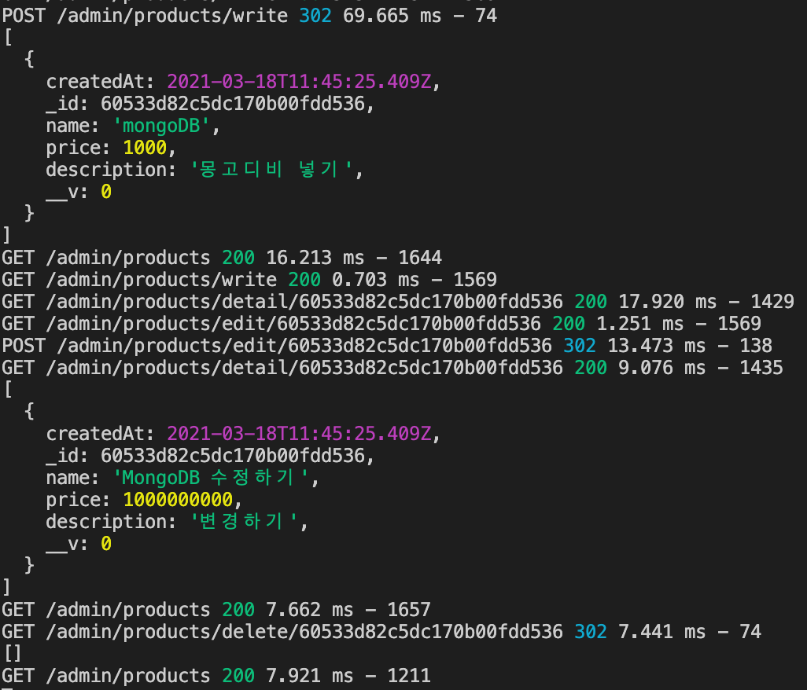

# MongoDB 이용한 CRUD

mysql때와 같은 로직을 사용하였습니다.

- 입력



```
ProductsModel.create(req.body);
```

create 함수를 써서 데이터를 넣습니다.

- 조회



```
ProductsModel.find();
```

find()를 사용하여 전체 목록을 조회합니다.

- 수정




```
ProductsModel.updateOne({ _id : req.params.id } , req.body );
```

updateOne으로 업데이트를 실행합니다.
단, 조건의 id는 _id를 사용해야 합니다.


- 삭제



```
ProductsModel.deleteOne({ _id : req.params.id });
```

deleteOne으로 삭제를 실행합니다.


- 로그

위에 실행 되었던 로그입니다.