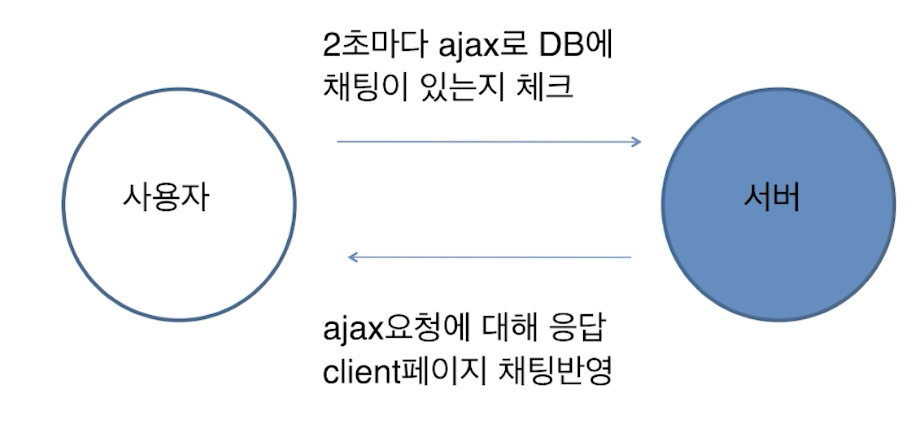
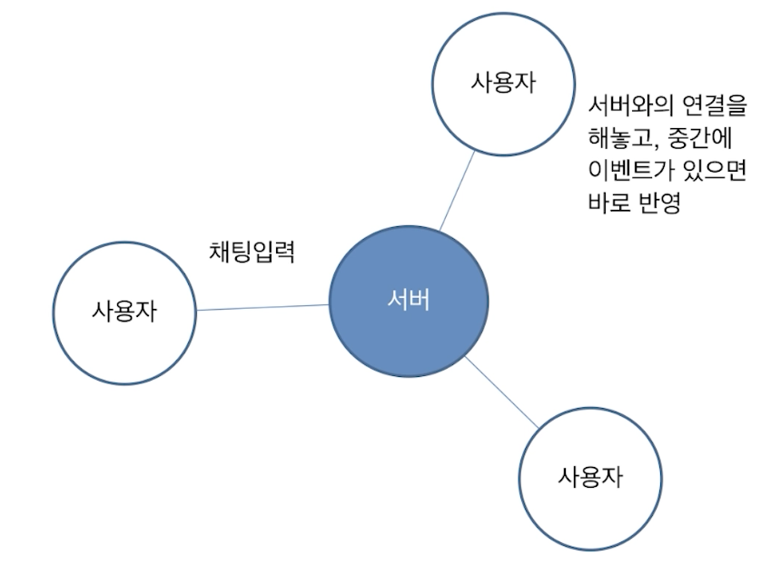
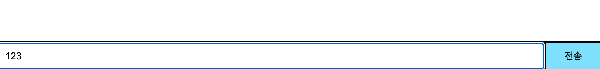
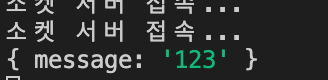
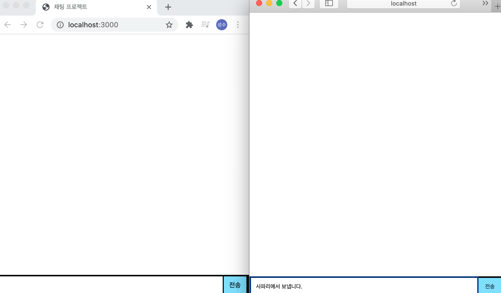
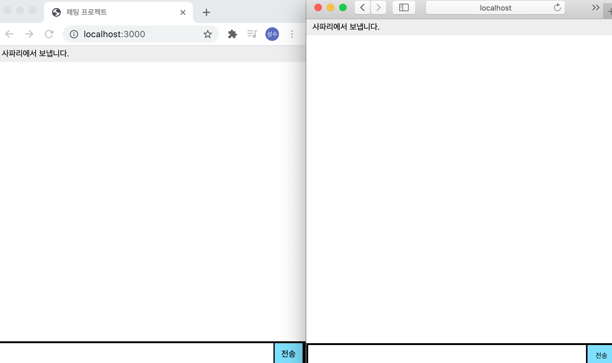
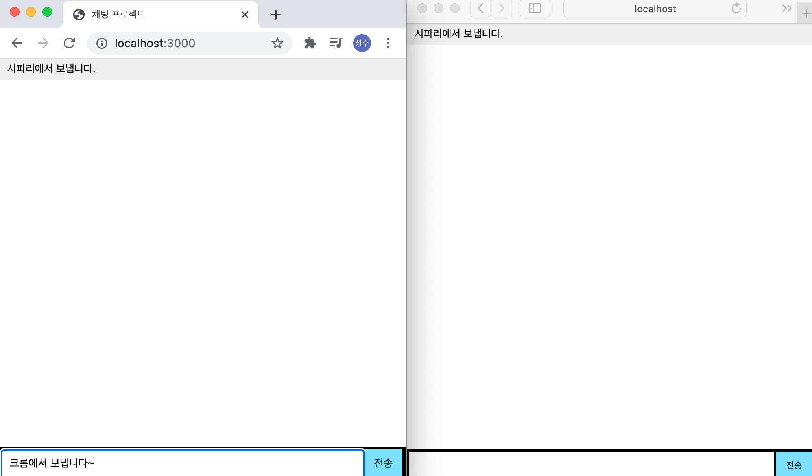
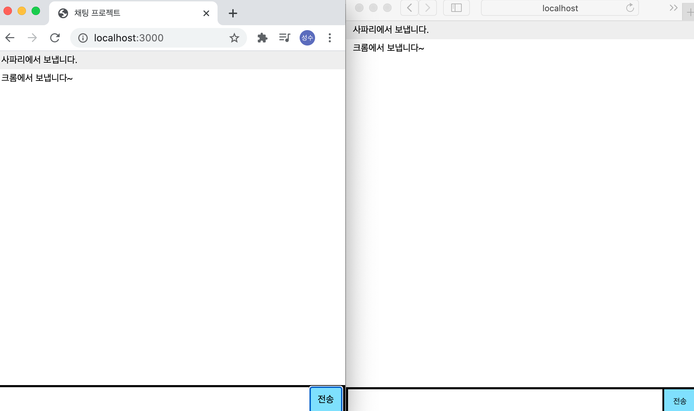

# 실시간 채팅 만들어보기

1. 단방향으로 구현



2. 양방향으로 구현




- socket.io 작동방식
websocket지원하는 브라우저에서는 그대로 사용


- 작동흐름
1. 웹페이지 접속
2. 클라이언트 var socket = io();
3. 서버와 연결관계를 맺음
4. 서버에 이벤트로 emit
5. 전체 클라이언트에 메시지 전달


- 소켓 접속

소켓의 접속을 할때, io()를 통해 접속이 가능하다.

```
var socket = io();
```

- 소켓 메시지 보내기

소켓으로 데이터를 보낼때는 emit() 를 사용하여 보낸다.

```
socket.emit();
```

하나의 예제로 클라이언트에서 데이터를 보낼때, 밑의 사진과 같이 나온다.





- 실제 프로젝트 예제

> 사파리, 크롬 브라우저를 사용하였습니다.


<br><br>

<br><br>

<br><br>


