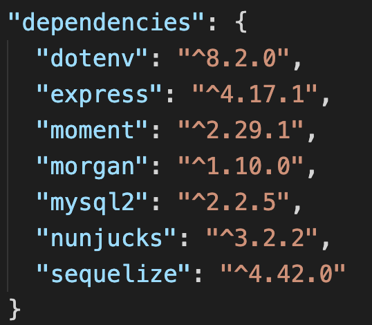
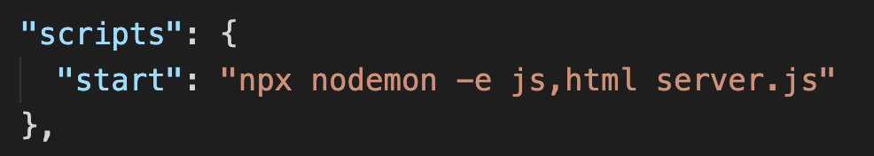
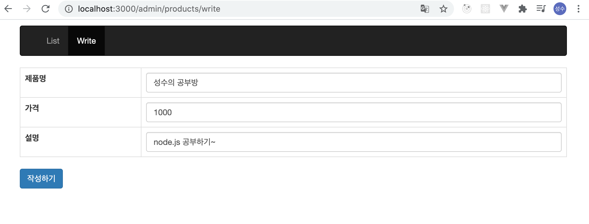
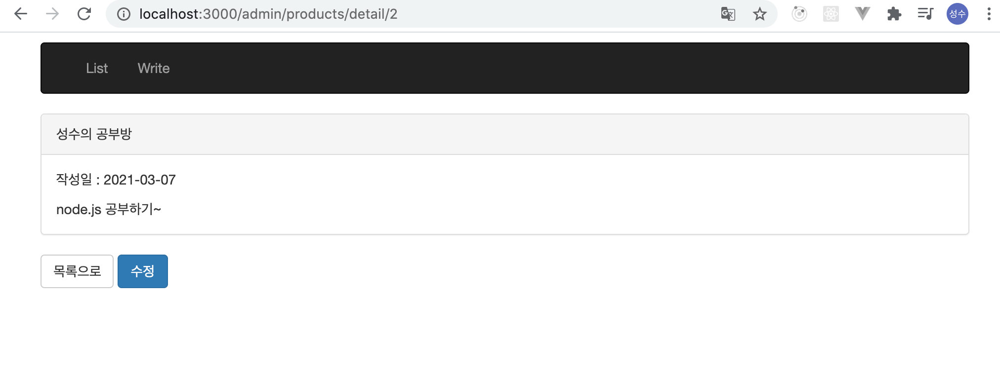
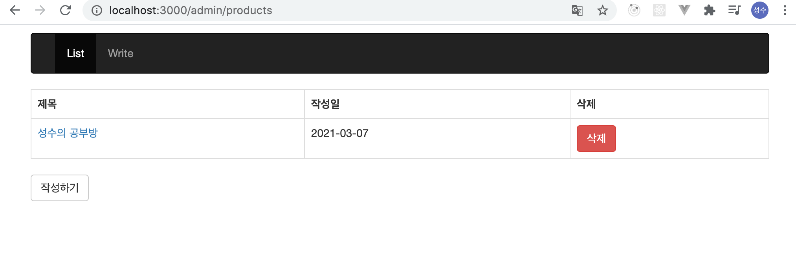
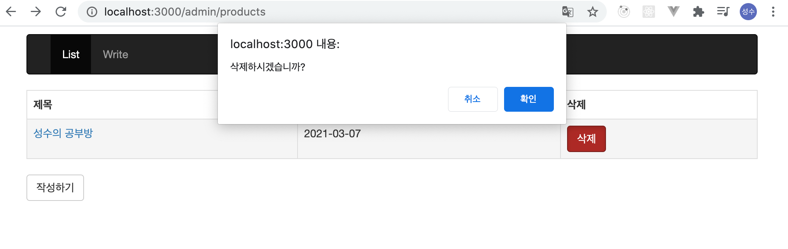

# node.js
---

node.js로 간단한 게시판 만들어보자.

- 기본 설정 

1.사용된 라이브러리

> dotenv => .env에 DB 설정 내용을 넣기 위해
> express => 미들웨어 및 url 설정 등
> moment => 날짜 포맷 변경
> morgan => 로그 확인을 위해
> mysql2 => mysql2 연결을 위한..
> nunjucks => template 사용
> sequelize => ORM 으로 DB 사용하기 위해

  

2. npm 실행 시 설정

nodemon을 사용해야 js 변경 시 서버가 재실행 됩니다.

 

- 게시판 기능 

1. 게시판의 내용을 입력합니다.
**http://localhost:port/admin/products/write**

 

1. 게시판의 내용을 상세하게 봅니다.
**http://localhost:port/admin/products/detail/:id**   

 

1. 게시판의 내용을 목록으로 봅니다.
**http://localhost:port/admin/products**

 

1. 게시판의 내용을 삭제합니다.
**http://localhost:port/admin/products/delete/:id/**

