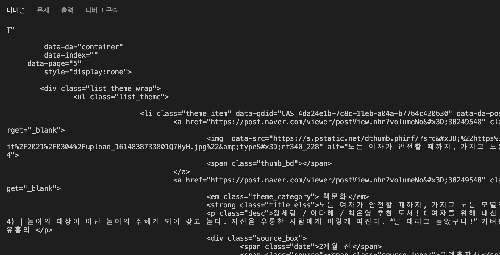
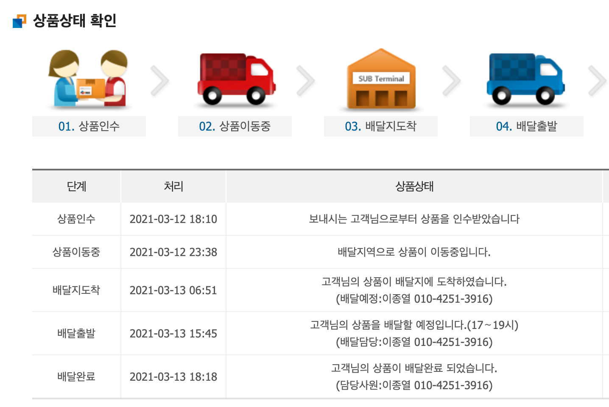
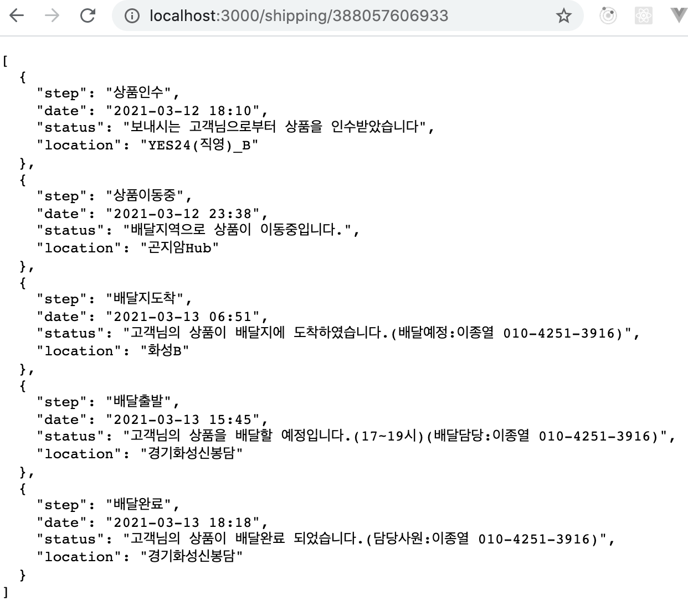

# 크롤링

- 크롤링 순서
  1. URL 에서 html를 가져온다.
  2. 내가 원하는 부분을 가져온다.


> 하기 전에 node.js 버전을 최신 버전으로 바뀐다.

```sh
nvm use stable
```

을 사용하면 최신버전으로 업데이트된다.


- 처음으로 네이버의 html (프론트)를 전부 다 가져와 보겠습니다.

```sh
node request.js
```



> 운송장 예제 번호 : 388057606933

<br><br>

- 원하는 내용 가져오기



대한통운 홈페이지의 일부분이다.<br>
실제로 사용할 내용은 날짜와 상태, 처리 등의 내용이다.

```sh
tdElements[i].children[0].data.trim();
```

이와 같이 elements와 children을 이용하여 내용을 빼볼 수 있다.

