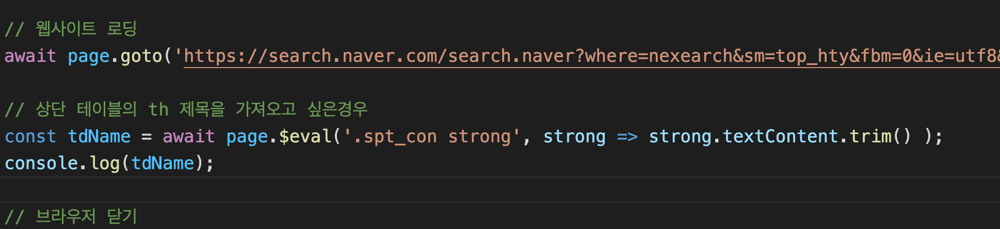

# puppeteer

- 네이버에서 '코스피' 값 가져오기



template.js 에 주소 값을 네이버의 주소 값을 넣는다.


네이버의 현재 코스피를 검색한 결과이다.

__.spt_con strong__ 클래스와 strong 태그안에 있는 코스피 값을 가져온다.


<br><br>

- 자신의 홈페이지에서 자동화 기능 만들기


여기 게시글을 작성하는 CRUD 기본 홈페이지가 있다.
여기서 작성과 수정, 삭제를 하는 기능을 추가하겠다.


이처럼 클래스나 name선택자나 자손선택자를 써서 click이나 값을 넣는 등의 행동을 할 수 있다.

특히, 화면이 움직이게 되면 __page.waitForSelector__ 라는 것을 이용해서 화면이 다 움직였는지 확인하는 것이 필요하다.

```sh
node template.js
```

를 사용하여 실행결과를 보겠다.


콘솔도 생성후, 수정되고 삭제 되었던 것을 알 수 있다.

> 여기서 잠깐

웹 페이지를 보면 alert이나 confirm 같은 자바스크립트에서 지원하는 확인이나 선택창이 존재하다.


puppeteer 에서는 처리를 위해 한가지 설정을 해야 한다.


page.on 에 dialog 를 모두 허락 하는 설정등을 할 수 있다.