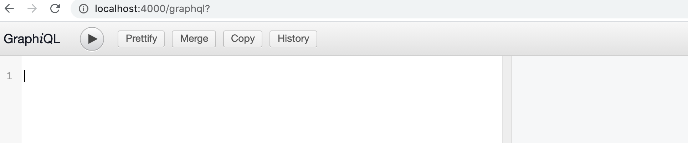
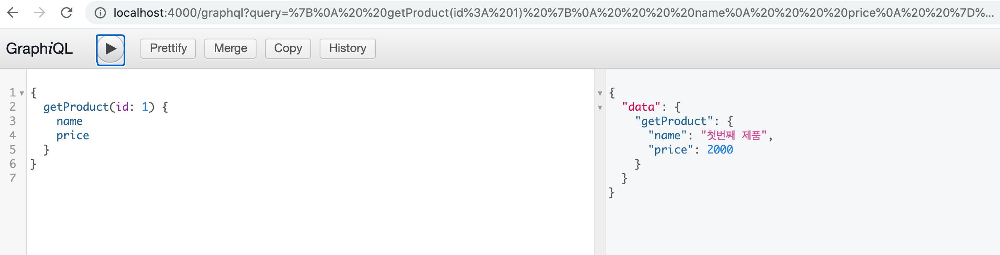
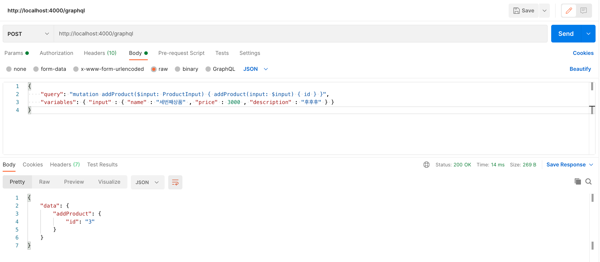
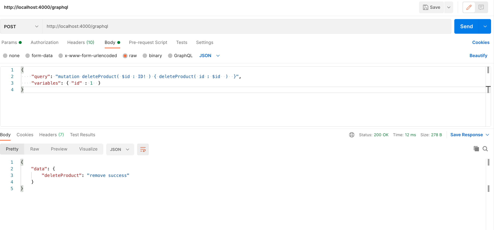

# GraphQL

node.js 에서 ___graphQL___ 라이브러리를 추가하여 사용 가능하다.

```js
app.use('/graphql', graphqlHTTP({
  schema: schema,
  rootValue: root,
  graphiql: true,
}));
```

express 와 같이 사용하는 경우에는 graphqlHttp url을 설정해준다.



graphQL를 사용하는 곳의 페이지를 볼 수 있다.

- READ



그림과 같이 메소드와 출력할 name, price를 입력하면 출력 결과가 옆에 나타난다.


- insert

postman이라는 프로그램을 이용하여 파라미터를 넣어봤습니다.

```
POST Content-Type application/json

{
    "query": "mutation addProduct($input: ProductInput) { 
        addProduct(input: $input) { id } 
    }",
    "variables": { 
        "input" : { 
            "name" : "세번째상품" , 
            "price" : 3000 , 
            "description" : "후후후" 
        } 
    }
}
```



- update

마찬가지로 postman을 이용하여 update를 해보겠다.

```
POST Content-Type application/json

{
    "query": "mutation updateProduct( $id : ID! , $input: ProductInput! ) { 
        updateProduct( id : $id  , input: $input) { id } 
    }",
    "variables": { 
        "id" : 1 ,
        "input" : { 
            "name" : "수정상품" , 
            "price" : 1000 , 
            "description" : "후후후" 
        } 
    }
}
```


- delete

delete는 update나 insert처럼 많은 데이터는 필요없고 id 값으로 지우면 된다.

```
POST Content-Type application/json

{
    "query": "mutation deleteProduct( $id : ID! ) { 
        deleteProduct( id : $id  )  
    }",
    "variables": { 
        "id" : 1  
    }
}
```

