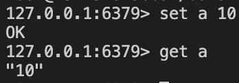
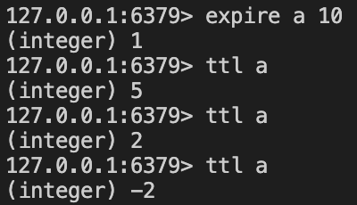
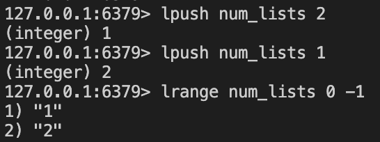
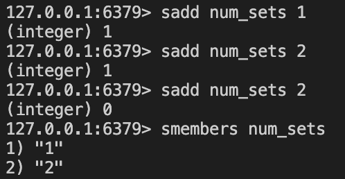
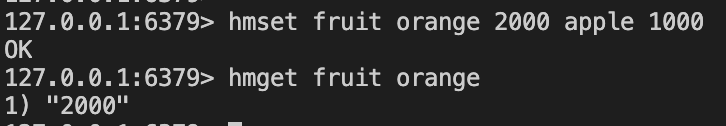

# redis

손쉽게 docker로 설치

```sh
docker run -p 6379:6379 redis
```

도커로 설치된 redis에서 cli를 실행하기 위해서는 밑에 명령어를 사용한다.

```sh
docker exec -it <컨터이너ID> /bin/bash
redis-cli
```

- redis 기본 사용법

> 변수를 넣기

```
set a 10
get a
```



>  변수의 유효기간 넣기

```
expire a 10
```



> 리스트 넣기 

```
lpush num_lists 2
lpush num_lists 1
lrange num_lists 0 -1
```



> set 넣기

```
sadd num_sets 1
sadd num_sets 2
sadd num_sets 2
smembers num_sets
```



> map 넣기

```
hmset fruit orange 2000 apple 1000
hmget frruit orange
```



